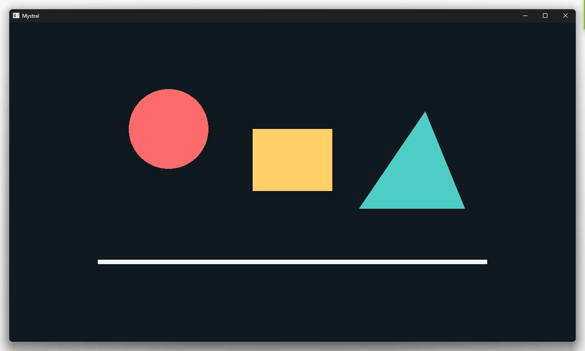
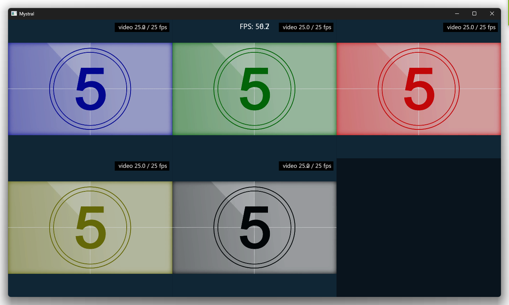

# q5.js + Mystral Native



Minimal [q5.js](https://q5js.org/) samples (experiments) for [Mystral Native](https://github.com/mystralengine/mystralnative).

The local build uses this [fork](https://github.com/ffunatsu/mystralnative/tree/dev).

This project also includes a locally modified [q5.js implementation](q5.js) (based on v4.8.2) for Mystral WebGPU compatibility.

( Also includes WebSocket/UDP(OSC)/SharedMemory tests for extension. )

> [!Note]
> This project is AI-assisted, using GitHub Copilot.

## Bundle and run (examples)

```bash 
.\bundle.ps1 # Windows
bash ./bundle.sh # macOS

mystral run bundle-main.js
```

Diagnostic bundle:

```text
.\bundle.ps1 diagnose     # Windows
bash ./bundle.sh diagnose # macOS
mystral run bundle-diagnose.js
```

## More examples

```text
.\bundle.ps1 mouse        # Windows
bash ./bundle.sh mouse    # macOS
mystral run bundle-mouse.js

.\bundle.ps1 image        # Windows
bash ./bundle.sh image    # macOS
mystral run bundle-image.js

.\bundle.ps1 shader        # Windows
bash ./bundle.sh shader    # macOS
mystral run bundle-shader.js
```

## GV video playback

The GV samples use the [Extreme GPU Friendly Video Format](https://github.com/Ushio/ofxExtremeGpuVideo?tab=readme-ov-file#extreme-gpu-friendly-video-format) and the [`rust-gv-video`](https://github.com/ffunatsu/rust-gv-video) decoder with random-access streaming. When the native WebGPU device supports BC texture compression, GV frames are uploaded as their original BC format instead of being expanded to RGBA/BGRA pixels.

Single GV playback:

```powershell
.\bundle.ps1 gv
mystral run bundle-gv.js
```

Multi-GV playback:

```powershell
.\bundle.ps1 gvs
mystral run bundle-gvs.js
```



## Mystral Local build

Windows (PowerShell):

```powershell
git submodule update --init --recursive
Set-Location mystralnative

C:\vcpkg\vcpkg.exe install curl:x64-windows

# Download the native dependencies. This includes SDL3 and libuv.
node scripts/download-deps.mjs

cmake -B build `
  -DCMAKE_TOOLCHAIN_FILE=C:/vcpkg/scripts/buildsystems/vcpkg.cmake `
  -DCMAKE_MSVC_RUNTIME_LIBRARY=MultiThreaded `
  -DMYSTRAL_USE_V8=ON -DMYSTRAL_USE_QUICKJS=OFF `
  -DMYSTRAL_USE_DAWN=ON -DMYSTRAL_USE_WGPU=OFF `
  -DMYSTRAL_USE_SWC=OFF
cmake --build build --config Release --parallel

# If still shows SDL/SDL.h not found, then

# node scripts/download-deps.mjs --only sdl3 --force

# and retry
```

macOS:

```bash
cmake -B build \
  -DMYSTRAL_USE_V8=ON -DMYSTRAL_USE_QUICKJS=OFF \
  -DMYSTRAL_USE_DAWN=ON -DMYSTRAL_USE_WGPU=OFF \
  -DMYSTRAL_USE_SWC=OFF
cmake --build build --config Release --parallel
```

Then, from the project root:

Windows:

```powershell
.\mystralnative\build\Release\mystral.exe run bundle-diagnose.js
```

macOS:

```bash
./mystralnative/build/mystral run bundle-diagnose.js
```

## License

Same as Mystral Native, q5.js, and [libsharedmemory](https://github.com/kyr0/libsharedmemory)

Please also check ones for licenses.
